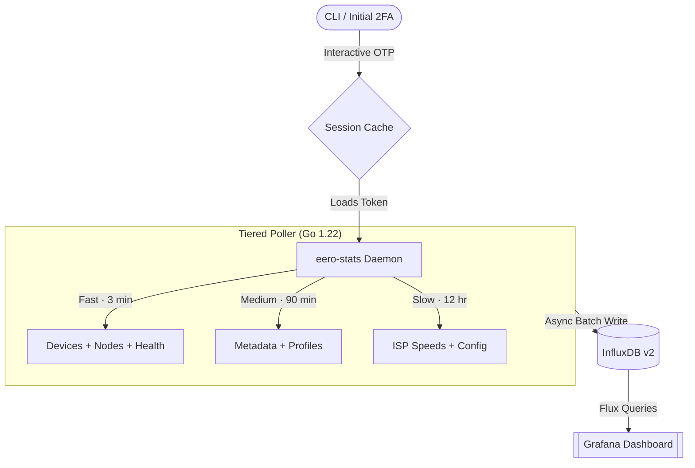

# Eero Stats Daemon

[](https://go.dev/)
[](https://github.com/arvarik/eero-stats/actions/workflows/ci.yml)
[](https://opensource.org/licenses/MIT)

`eero-stats` is a lightweight daemon that extracts real-time metrics from your **Eero Mesh Network** and writes them to an **InfluxDB v2** time-series database.

Designed for minimal flash storage wear (ideal for TrueNAS SCALE, Unraid, or Proxmox NVMe setups), the daemon uses aggressive write batching to pool metrics in memory before async-flushing to disk.

It ships with a fully automated **Grafana dashboard** covering network health, device signal quality, node telemetry, and more.

---

## Architecture

The daemon uses **tiered interval-based polling** to balance data freshness against Eero API rate limits:

| Tier | Interval | Data Collected |
| :--- | :---: | :--- |
| **Fast** | 3 min | Device connectivity, node health, network status |
| **Medium** | 90 min | Node/device metadata, profile mappings |
| **Slow** | 12 hr | ISP speed tests, network configuration snapshots |



---

## Project Structure

```
eero-stats/
├── cmd/eero-stats/          # Application entry point
│   └── main.go              #   Daemon bootstrap and graceful shutdown
├── internal/
│   ├── auth/                # Eero API authentication (session cache + 2FA)
│   │   └── auth.go
│   ├── config/              # Environment variable loading and validation
│   │   └── config.go
│   ├── db/                  # InfluxDB client wrapper (NVMe-optimized batching)
│   │   └── influx.go
│   └── poller/              # Tiered polling engine
│       ├── poller.go        #   Poll loop orchestration
│       ├── writers.go       #   InfluxDB data point writers
│       └── retry.go         #   Exponential backoff retry helper
├── grafana/
│   ├── dashboards/          # Provisioned Grafana dashboard JSON
│   └── provisioning/        # Datasource and dashboard provider configs
├── scripts/
│   └── build_dashboard.py   # Regenerates the Grafana dashboard JSON
├── docker-compose.yml       # Full stack: daemon + InfluxDB + Grafana
├── Dockerfile               # Multi-stage build (builder + alpine runtime)
├── Makefile                 # Build, lint, Docker, and dashboard targets
└── .env.example             # Template for required environment variables
```

---

## 🚀 Quick Start (Docker Compose)

### 1. Clone & Configure

```bash
git clone https://github.com/arvarik/eero-stats.git
cd eero-stats
cp .env.example .env
```

Edit `.env` to include your Eero login email or phone number.

### 2. Start the Stack

```bash
make docker-up
```

This launches the daemon, InfluxDB, and Grafana containers.

> [!NOTE]
> **Linux Users:** If you encounter a `permission denied` error with Docker, add your user to the `docker` group:
> ```bash
> sudo usermod -aG docker $USER
> ```
> Log out and back in for the change to take effect.

### 3. Authenticate (First Boot Only)

The first time the daemon starts, it requires a one-time 2FA verification:

```bash
docker attach eero-stats
```

Enter the verification code sent to your email/phone. On success, the session token is cached to `/data/app/.eero_session.json`.

**Detach** with `CTRL-P` then `CTRL-Q` to let the daemon continue in the background.

> [!NOTE]
> **Session Lifecycle:** The Eero API issues a long-lived token (typically valid ~30 days). If the daemon starts logging `401 Unauthorized` errors, stop the container (`make docker-down`), delete `./data/app/.eero_session.json`, and re-run steps 2–3 to re-authenticate.

### 4. View the Dashboard

Open Grafana at `http://<your-ip>:3000` (login: `admin` / `admin`). The **Eero Network Telemetry** dashboard is automatically provisioned.

---

## Configuration

All settings are injected via `.env`:

| Variable | Required | Description |
| :--- | :---: | :--- |
| `EERO_LOGIN` | **Yes** | Email or phone for your Eero Owner Account |
| `INFLUX_URL` | No | InfluxDB URL (default: `http://influxdb:8086`) |
| `INFLUX_TOKEN` | No | InfluxDB API token (default: `my-super-secret-auth-token-123`) |
| `INFLUX_ORG` | No | InfluxDB organization (default: `eero-stats-org`) |
| `INFLUX_BUCKET` | No | InfluxDB bucket (default: `eero`) |

---

## Contributing & Local Development

### First-Time Setup

```bash
make setup    # Configures Git hooks for pre-commit linting
```

### Development Workflow

| Command | Description |
| :--- | :--- |
| `make tidy` | Run `go mod tidy` and `go fmt` |
| `make lint` | Run `golangci-lint` |
| `make build` | Compile the daemon to `bin/eero-stats` |
| `make dashboard` | Regenerate the Grafana dashboard JSON |
| `make docker-up` | Start the full Docker Compose stack |
| `make docker-down` | Stop all containers |
| `make clean` | Remove build artifacts |

### Extending the Poller

To add new metrics, create writer methods on `*Poller` in `internal/poller/writers.go` and call them from the appropriate polling tier in `internal/poller/poller.go`. Each writer follows a consistent pattern:

1. Build a `tags` map (indexed dimensions)
2. Build a `fields` map (metric values)
3. Write with `influxdb2.NewPoint(measurement, tags, fields, timestamp)`

---

## License

This project is open-sourced under the [MIT License](LICENSE).
