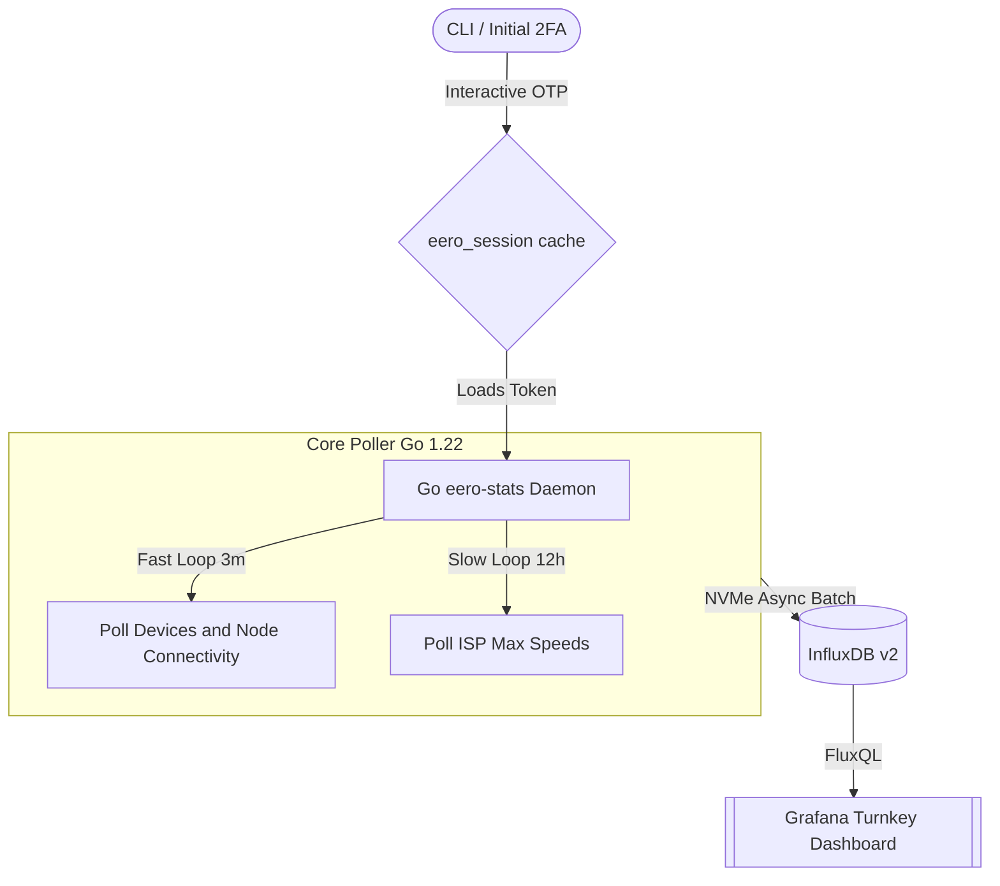

# Eero Stats Daemon

[](https://go.dev/)
[](https://github.com/arvarik/eero-stats/actions/workflows/ci.yml)
[](https://opensource.org/licenses/MIT)

`eero-stats` is a lightweight, strictly-typed local daemon designed to extract real-time metrics from your Eero Mesh Network and push them natively to an InfluxDB `v2` time-series database.

Designed from the ground up for minimal flash storage wear (ideal for TrueNAS SCALE, Unraid, or Proxmox NVMe setups), the daemon utilizes heavy write batching inside the `eero-go` client to pool metrics before async syncing to the SSD.

It comes bundled with a fully automated Grafana dashboard showing your home network speeds, device signal qualities, and online node mappings.

---

## Architecture Flow

The data aggregation lifecycle automatically mitigates IP bans via tiered, interval-based API polling:



---

## 🚀 Quick Start (Docker Compose)

### 1. Clone & Configure
First, clone the daemon repository:

```bash
git clone https://github.com/arvarik/eero-stats.git
cd eero-stats
cp .env.example .env
```
*Note: Edit the `.env` file to include your actual Eero login email or phone.*

### 2. Standup the Infrastructure
Launch the multi-container stack which includes the daemon, InfluxDB, and Grafana:

```bash
make docker-up
```

### 3. Interactive Authentication (First Boot Only)
Since this daemon runs locally against Eero's Cloud API, the first time you boot `eero-stats`, you must supply a 2-step verification code from your email/phone. The Docker container stays open to `stdin`:

```bash
# Attach to the running daemon container to provide inputs
docker attach eero-stats
```

You will see: `Enter verification code:`. Provide the OTP you received from Eero. 
Upon success, `eero-stats` writes your authorization token to `/data/app/.eero_session.json`.

**Detaching:** Press `CTRL-P` followed by `CTRL-Q` to safely detach your terminal and let the daemon continue polling in the background!

### 4. View Grafana
Open Grafana running locally at `http://<your-ip>:3000`. You can login using the defaults (`admin/admin`). The "Eero Overview" dashboard is automatically provisioned—no setup required.

---

## Configuration Reference

All settings are securely injected via `.env`.

| Variable | Requirement | Description |
| :--- | :---: | :--- |
| `EERO_LOGIN` | **Required** | The email or phone associated with your Eero Owner Account. |
| `INFLUX_URL` | Optional | Internal URL to InfluxDB container (`http://influxdb:8086`). |
| `INFLUX_TOKEN` | Optional | API Token (defaults to `my-super-secret-auth-token-123`). |
| `INFLUX_ORG` | Optional | InfluxDB Organization (defaults to `eero-stats-org`). |
| `INFLUX_BUCKET` | Optional | InfluxDB Bucket (defaults to `eero`). |

---

## Contributing & Local Development

Want to test local changes without standing up the entire Docker cluster? `eero-stats` has an open-source friendly `Makefile`.

1. **Hygiene**: Run `make tidy` to format your Go files and clean `go.mod`.
2. **Linting**: Run `make lint` to enforce standard coding conventions using `golangci-lint`.
3. **Build**: Run `make build` to locally compile the daemon into `.bin/eero-stats`.

### License
This project is open-sourced under the permission [MIT License](LICENSE).
